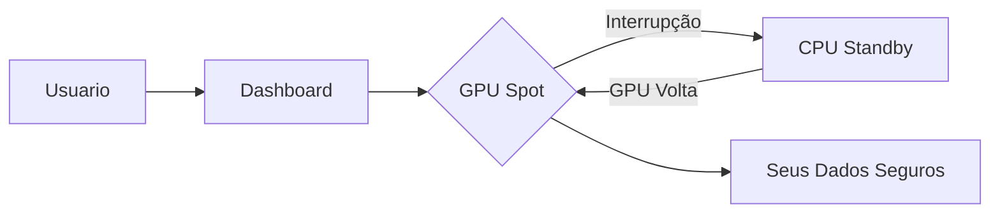

# Bem-vindo ao Dumont Cloud

## O que e o Dumont Cloud?

**Dumont Cloud** e uma plataforma de GPU Cloud que oferece o melhor custo-beneficio do mercado, combinando GPUs Spot de baixo custo com failover automatico para garantir alta disponibilidade.

### Por que escolher Dumont Cloud?

| Beneficio | Descricao |
|-----------|-----------|
| **89% mais barato** | GPUs ate 10x mais baratas que AWS/GCP |
| **Zero data loss** | Failover automatico preserva seus dados |
| **Setup em 5 min** | Interface simples e intuitiva |
| **Suporte 24/7** | Time brasileiro sempre disponivel |

---

## Como Funciona

1. **Voce escolhe** uma GPU no nosso marketplace
2. **Lancamos** sua maquina em segundos
3. **Monitoramos** 24/7 por interrupcoes
4. **Se cair**, failover automatico para CPU (sem perder dados)
5. **Quando voltar**, migramos de volta para GPU

---

## Proximos Passos

- [Criar sua conta](/admin/doc/live#01_Getting_Started/02_Quick_Start.md)
- [Adicionar creditos](/admin/doc/live#02_User_Guide/01_Billing.md)
- [Lancar sua primeira GPU](/admin/doc/live#02_User_Guide/02_Machines.md)

---

## Precos

| GPU | Preco/hora | vs AWS |
|-----|------------|--------|
| RTX 4090 | $0.40 | -87% |
| RTX 3090 | $0.30 | -90% |
| A100 40GB | $1.20 | -85% |
| H100 | $2.50 | -80% |

> **Trial Gratuito**: 7 dias gratis no plano Pro ($79 em creditos)
