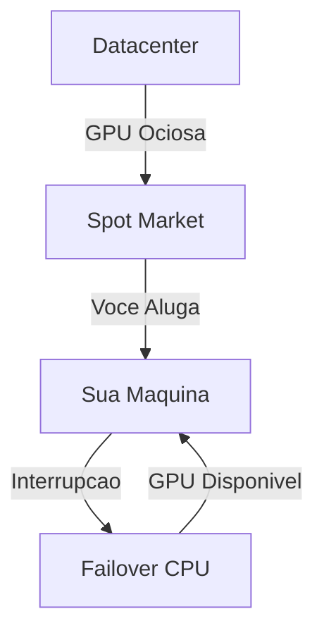

# Spot Market

## O que e Spot Market?

O Spot Market e onde voce encontra GPUs com **descontos de ate 90%** comparado com precos on-demand. Essas GPUs sao recursos ociosos de datacenters que podem ser interrompidos com aviso previo.

---

## Como Funciona

### Vantagens
- **Ate 90% mais barato** que on-demand
- Mesma performance que GPUs dedicadas
- **Failover automatico** para CPU standby

### Desvantagens
- Pode ser interrompido (aviso de 30s a 2min)
- Disponibilidade variavel
- Nao ideal para producao critica

---

## Precos Spot vs On-Demand

| GPU | Spot | On-Demand | Economia |
|-----|------|-----------|----------|
| RTX 4090 | $0.40/h | $1.50/h | 73% |
| RTX 3090 | $0.30/h | $1.20/h | 75% |
| A100 40GB | $1.20/h | $4.00/h | 70% |
| H100 | $2.50/h | $8.00/h | 69% |

---

## Buscar no Spot Market

### Via Dashboard
1. Va em **Spot Market** no menu
2. Filtre por:
   - Tipo de GPU
   - Preco maximo
   - VRAM minima
   - Regiao
3. Ordene por preco ou disponibilidade
4. Clique em **"Alugar"**

### Filtros Disponiveis

| Filtro | Opcoes |
|--------|--------|
| **GPU** | RTX 3090, 4090, A100, H100 |
| **VRAM** | 8GB, 16GB, 24GB, 40GB, 80GB |
| **Preco** | $0.10 - $5.00/hora |
| **Regiao** | US, EU, Asia |
| **Confiabilidade** | Alta, Media, Baixa |

---

## Indicadores de Confiabilidade

### Taxa de Interrupcao
Baseado no historico das ultimas 24h:

| Indicador | Taxa | Significado |
|-----------|------|-------------|
| **Verde** | <5% | Muito estavel |
| **Amarelo** | 5-15% | Moderado |
| **Vermelho** | >15% | Frequente interrupcao |

### Tempo Medio de Duracao
Quanto tempo em media a GPU fica disponivel antes de ser interrompida.

---

## Estrategias de Uso

### Para Treinamento
1. Use checkpoints frequentes (a cada 30min)
2. Ative failover para CPU
3. Configure auto-resume apos interrupcao

### Para Inferencia
1. Use multiplas GPUs em regioes diferentes
2. Load balancer distribui requests
3. Se uma cai, outras assumem

### Para Experimentos
1. Ideal para testes e prototipacao
2. Economize ate 90% em dev/staging
3. Use on-demand apenas para producao

---

## Failover Automatico

Quando sua GPU Spot e interrompida:

1. **Deteccao** (~5 segundos)
2. **Sincronizacao** de dados para R2
3. **Failover** para CPU standby
4. **Notificacao** via email/push
5. **Restauracao** automatica quando GPU volta

### Configurar Failover
1. Va em **Settings** > **Failover**
2. Ative **"Auto-failover para CPU"**
3. Escolha tipo de CPU standby:
   - **e2-medium**: $0.03/h (basico)
   - **e2-standard-4**: $0.15/h (recomendado)
   - **n2-standard-8**: $0.40/h (alta performance)

---

## Alertas de Preco

### Configurar Alerta
1. Va em **Spot Market** > **Alertas**
2. Clique em **"Novo Alerta"**
3. Configure:
   - GPU desejada
   - Preco maximo
   - Regiao (opcional)
4. Escolha notificacao (email, push, SMS)

### Exemplo
> "Me avise quando RTX 4090 estiver abaixo de $0.35/h em US-East"
