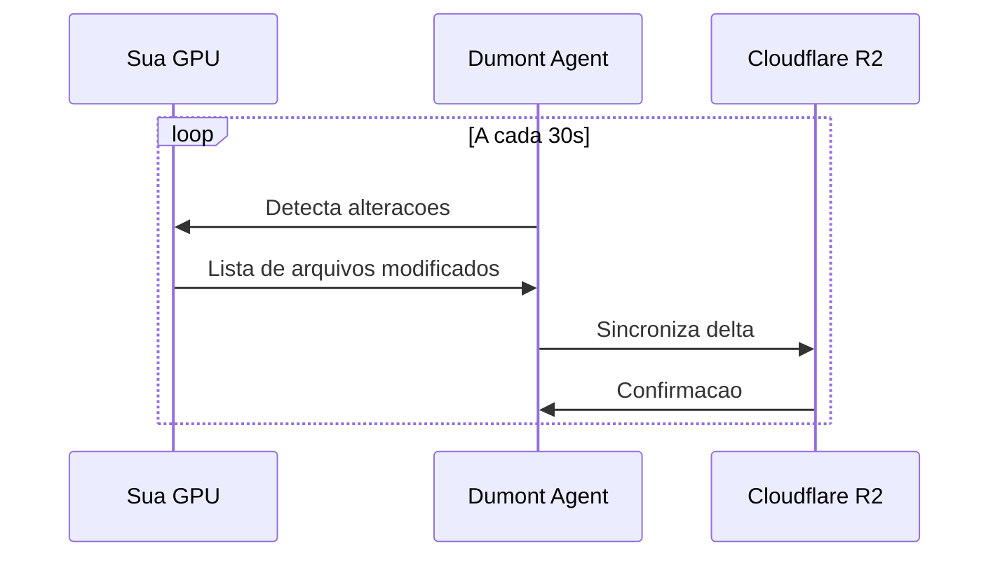

# Backup Automatico

## Visao Geral

O Dumont Cloud faz backup automatico dos seus dados a cada 30 segundos, garantindo que voce nunca perca trabalho mesmo em caso de interrupcao.

---

## Como Funciona



### Tecnologia
- **Restic**: Backup incremental eficiente
- **Cloudflare R2**: Storage distribuido globalmente
- **Deduplicacao**: Mesmo arquivo nao e duplicado
- **Compressao**: Zstd para menor uso de banda

---

## O que e Backup

### Incluido Automaticamente
- `/root/` - Seu home directory
- `/workspace/` - Arquivos de trabalho
- `/data/` - Datasets
- Arquivos modificados nas ultimas 24h

### Excluido (por padrao)
- `/tmp/` - Arquivos temporarios
- `*.pyc`, `__pycache__/` - Cache Python
- `.git/objects/` - Objetos Git grandes
- `node_modules/` - Dependencias
- Arquivos > 10GB (configuravel)

---

## Configurar Backup

### Diretorios Customizados
1. Va em **Settings** > **Backup**
2. Clique em **"Adicionar Diretorio"**
3. Especifique o caminho (ex: `/my-data/`)
4. Clique em **"Salvar"**

### Exclusoes
Crie um arquivo `.dumontignore` na raiz:
```
# Ignorar datasets grandes
*.tar.gz
*.zip
models/checkpoints/old/

# Ignorar cache
.cache/
*.tmp
```

---

## Frequencia de Backup

### Planos

| Plano | Frequencia | Retencao |
|-------|------------|----------|
| Free | 5 minutos | 7 dias |
| Pro | 30 segundos | 30 dias |
| Enterprise | 10 segundos | 90 dias |

### Ajustar Frequencia
1. Va em **Settings** > **Backup**
2. Altere **"Intervalo de Sync"**
3. Opcoes: 10s, 30s, 1min, 5min

---

## Restaurar Backup

### Via Dashboard
1. Va em **Machines** > selecione a maquina
2. Clique em **"Backups"**
3. Escolha o ponto no tempo
4. Clique em **"Restaurar"**

### Via CLI
```bash
# Listar backups disponiveis
dumont backup list

# Restaurar ultimo backup
dumont backup restore --latest

# Restaurar de data especifica
dumont backup restore --date "2024-01-15 14:30"

# Restaurar arquivo especifico
dumont backup restore --path "/workspace/model.py"
```

---

## Snapshots Manuais

Alem do backup automatico, voce pode criar snapshots manuais:

### Criar Snapshot
1. Selecione a maquina
2. Clique em **"Criar Snapshot"**
3. De um nome descritivo
4. Aguarde (~2-5 minutos)

### Usar Snapshot
- Restaurar para a mesma maquina
- Clonar para nova maquina
- Compartilhar com outro usuario

---

## Monitoramento

### Verificar Status
No dashboard, veja:
- **Ultimo backup**: Quando foi o ultimo sync
- **Arquivos pendentes**: Quantos arquivos aguardam sync
- **Storage usado**: Espaco total de backup

### Alertas
Configure alertas para:
- Backup falhou 3x consecutivas
- Storage > 80% do limite
- Sync atrasado > 5 minutos

---

## Precos de Storage

| Uso | Preco |
|-----|-------|
| Primeiros 50GB | Gratis |
| 50GB - 500GB | $0.01/GB/mes |
| 500GB - 5TB | $0.008/GB/mes |
| Acima de 5TB | $0.005/GB/mes |

### Exemplo
100GB de backup = 50GB gratis + 50GB × $0.01 = **$0.50/mes**
