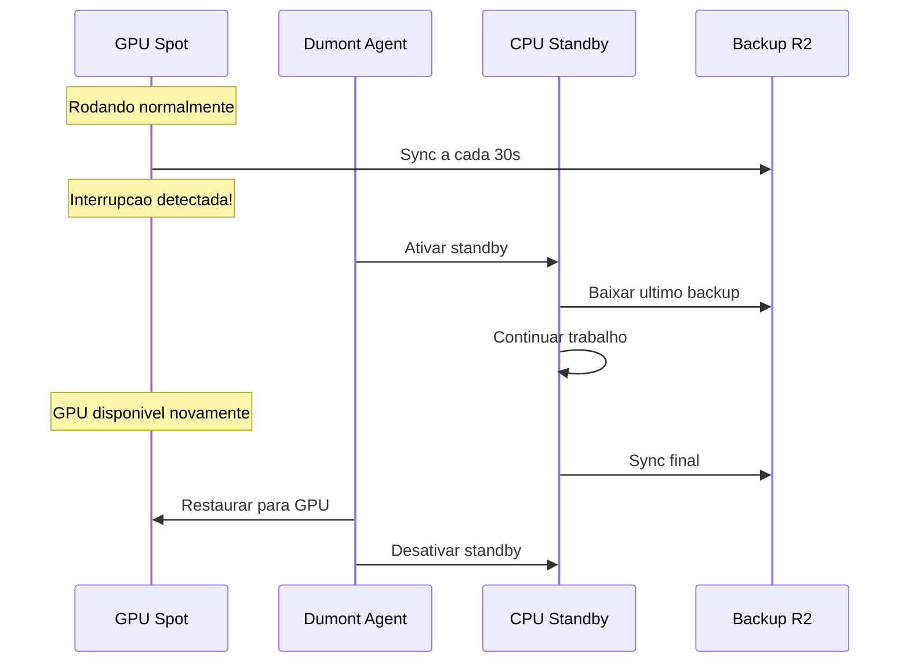

# CPU Standby (Failover)

## O que e CPU Standby?

CPU Standby e uma maquina de baixo custo que assume quando sua GPU Spot e interrompida, garantindo que voce nunca perca dados ou tenha downtime.

---

## Como Funciona



### Fluxo
1. **Normal**: GPU roda, sincroniza dados a cada 30s
2. **Interrupcao**: GPU cai, sistema detecta em ~5s
3. **Failover**: CPU Standby assume, restaura ultimo backup
4. **Continuidade**: Voce pode continuar trabalhando na CPU
5. **Restauracao**: Quando GPU volta, migra de volta automaticamente

---

## Tipos de CPU Standby

| Tipo | vCPUs | RAM | Preco | Uso |
|------|-------|-----|-------|-----|
| **e2-medium** | 2 | 4GB | $0.03/h | Basico |
| **e2-standard-4** | 4 | 16GB | $0.15/h | Recomendado |
| **n2-standard-8** | 8 | 32GB | $0.40/h | Intensivo |
| **c2-standard-16** | 16 | 64GB | $0.80/h | HPC |

---

## Configurar CPU Standby

### Ativar
1. Va em **Settings** > **Failover**
2. Ative **"CPU Standby Automatico"**
3. Escolha o tipo de CPU
4. Salve

### Por Maquina
1. Selecione a maquina em **Machines**
2. Clique em **"Configuracoes"**
3. Ative **"Failover para CPU"**
4. Escolha comportamento:
   - **Automatico**: Failover + restore automatico
   - **Manual**: Failover automatico, restore manual
   - **Desativado**: Sem failover

---

## O que Acontece Durante Failover

### Dados Preservados
- Arquivos sincronizados (ultimo backup)
- Variaveis de ambiente
- Configuracoes do sistema

### Dados Perdidos
- Processos em memoria (nao salvos)
- Conexoes de rede ativas
- Arquivos nao sincronizados

### Notificacoes
Voce recebe notificacao quando:
- Failover iniciado
- CPU Standby ativo
- GPU restaurada
- Failback completo

---

## Durante o Standby

### O que voce pode fazer
- Acessar arquivos
- Rodar scripts leves
- Preparar dados
- Fazer debugging

### O que nao e recomendado
- Treinar modelos grandes
- Inferencia pesada
- Compilacao intensiva

### Custo
Voce paga apenas pela CPU Standby enquanto ativa:
- GPU: $0.00 (pausada)
- CPU: $0.15/h (ativa)

---

## Tempo de Failover

| Etapa | Tempo |
|-------|-------|
| Deteccao de interrupcao | ~5s |
| Ativacao do standby | ~10s |
| Download do backup | ~30s-5min* |
| Sistema pronto | ~1min |

*Depende do tamanho dos dados

### Otimizar Tempo
- Mantenha backups pequenos (exclua arquivos grandes)
- Use SSD no standby
- Escolha regiao proxima

---

## Monitoramento

### Ver Status
No dashboard, veja:
- Estado atual (GPU/CPU Standby)
- Tempo em standby
- Custo acumulado
- Ultimas interrupcoes

### Historico
1. Va em **Machines** > **Historico de Failover**
2. Veja todas as interrupcoes
3. Analise padroes (horarios, duracoes)

---

## Precos

### CPU Standby
Voce paga apenas quando a CPU esta ativa:

| Evento | Custo |
|--------|-------|
| GPU rodando | $0.40/h (GPU) |
| Interrupcao (failover) | $0.15/h (CPU) |
| GPU volta (failback) | $0.40/h (GPU) |

### Exemplo
```
GPU rodando: 10 horas × $0.40 = $4.00
Interrupcoes: 30 min em CPU × $0.15 = $0.075
Total: $4.075
```

---

## Best Practices

### Checkpoints Frequentes
Salve checkpoints a cada 15-30 minutos para minimizar perda:
```python
# PyTorch
torch.save(model.state_dict(), f'checkpoint_{epoch}.pt')

# TensorFlow
model.save_weights(f'checkpoint_{epoch}')
```

### Scripts de Resume
Crie scripts que detectam e retomam do ultimo checkpoint:
```python
import glob

checkpoints = glob.glob('checkpoint_*.pt')
if checkpoints:
    latest = max(checkpoints)
    model.load_state_dict(torch.load(latest))
    print(f"Resuming from {latest}")
```

### Graceful Shutdown
Trate sinais de interrupcao:
```python
import signal

def handle_interrupt(signum, frame):
    print("Salvando checkpoint final...")
    torch.save(model.state_dict(), 'checkpoint_final.pt')
    exit(0)

signal.signal(signal.SIGTERM, handle_interrupt)
```
