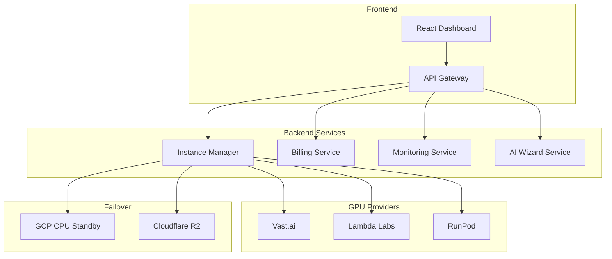
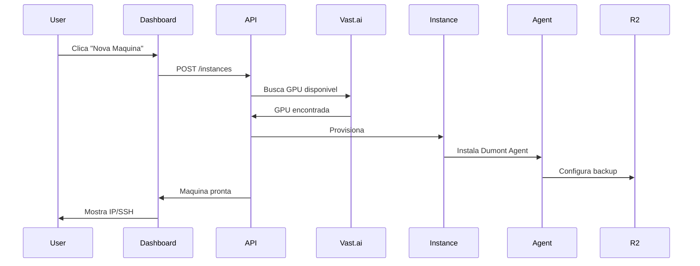
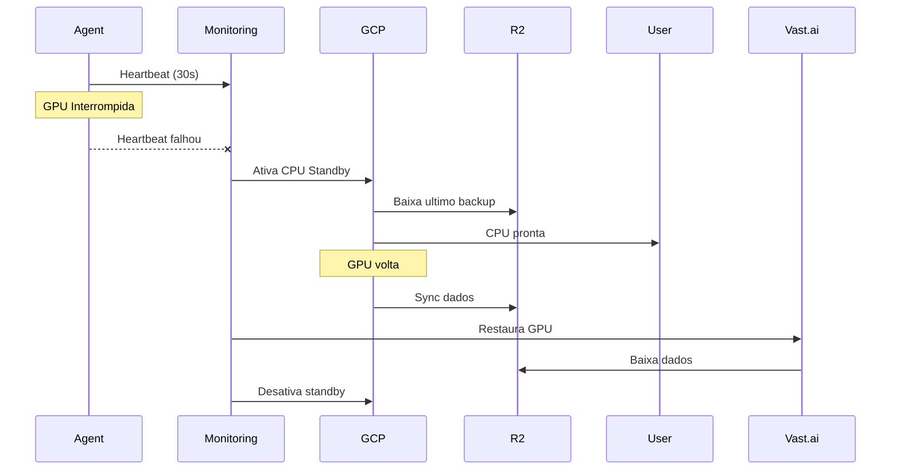

# Arquitetura do Sistema

## Visao Geral

O Dumont Cloud e construido com uma arquitetura de microservicos, focada em resiliencia, escalabilidade e baixo custo.

---

## Diagrama de Alto Nivel



---

## Componentes

### Frontend
- **React 18** com Vite
- **TailwindCSS** para styling
- **Chart.js** para graficos
- **React Router** para navegacao

### Backend
- **FastAPI** (Python 3.11)
- **PostgreSQL** para dados
- **Redis** para cache e filas
- **Celery** para tarefas async

### Infrastructure
- **Cloudflare** CDN e DNS
- **GCP** para CPU Standby
- **R2** para backups
- **Let's Encrypt** para SSL

---

## Fluxo de Dados

### Criar Maquina


### Failover


---

## Banco de Dados

### Principais Tabelas
- `users` - Contas de usuario
- `instances` - Maquinas ativas
- `transactions` - Historico de cobrancas
- `backups` - Metadados de backup
- `events` - Log de eventos

### Indices
```sql
CREATE INDEX idx_instances_user ON instances(user_id);
CREATE INDEX idx_instances_status ON instances(status);
CREATE INDEX idx_transactions_date ON transactions(created_at);
```

---

## Cache

### Redis Keys
```
user:{id}:balance      -> Saldo atual
user:{id}:instances    -> Lista de maquinas
instance:{id}:status   -> Status em tempo real
spot:prices:{gpu}      -> Precos spot (5min TTL)
```

---

## Seguranca

### Autenticacao
- JWT tokens com rotacao
- API Keys com escopos
- OAuth2 (Google, GitHub)

### Criptografia
- TLS 1.3 em transito
- AES-256 em repouso
- Bcrypt para senhas

### Isolamento
- Cada instancia em rede isolada
- Firewall por maquina
- SSH keys por usuario

---

## Monitoramento

### Metricas (Prometheus)
- Latencia de API
- Uso de GPU/CPU
- Taxa de erros
- Tempo de failover

### Logs (Loki)
- Logs estruturados (JSON)
- Retencao de 30 dias
- Alertas via Grafana

### Alertas
- PagerDuty para criticos
- Slack para warnings
- Email para info

---

## Escalabilidade

### Horizontal
- API: Auto-scaling baseado em CPU
- Workers: Scaling por fila
- DB: Read replicas

### Limites
| Componente | Limite |
|------------|--------|
| Instancias/usuario | 50 |
| Requisicoes/min | 300 |
| Tamanho backup | 1TB |

---

## Disaster Recovery

### Backup
- Database: Snapshot diario
- R2: Replicacao multi-region
- Configs: Git + Vault

### RTO/RPO
| Servico | RTO | RPO |
|---------|-----|-----|
| API | 5 min | 0 |
| Database | 1 hora | 5 min |
| Backups usuario | 30 min | 30 seg |
