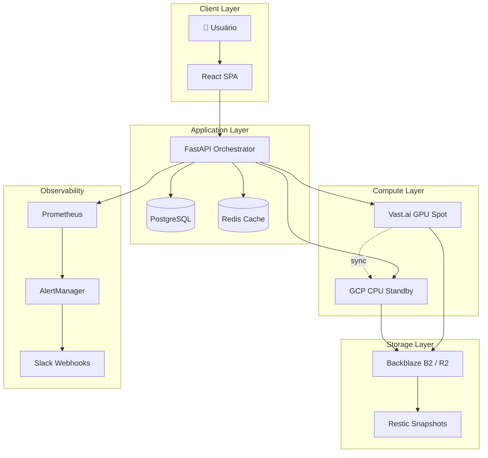
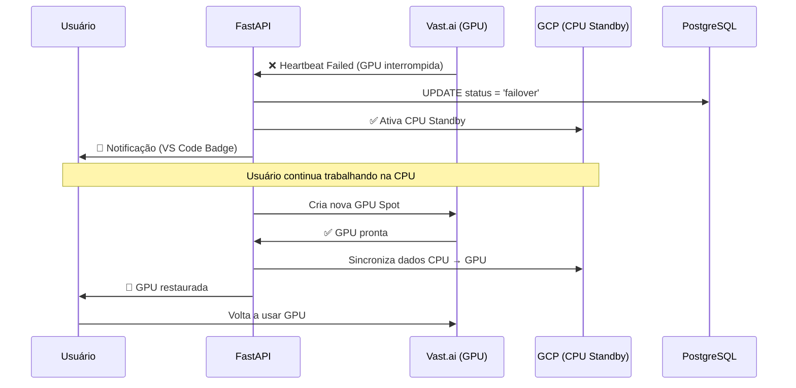

# 🏗️ Arquitetura - Dumont Cloud

## Visão Geral

Dumont Cloud opera em uma **topologia híbrida de 3 camadas** para garantir resiliência e baixo custo:



---

## 📦 Stack Tecnológica

### Backend
- **FastAPI** (Python 3.10+) - REST API
- **PostgreSQL 15** - Dados transacionais
- **Redis 7** - Cache e filas
- **Uvicorn/Gunicorn** - ASGI server

### Frontend
- **React 18** - SPA
- **Vite** - Build tool
- **TailwindCSS** - Styling
- **React Router** - Navegação

### Infra & Providers
- **Vast.ai** - GPU Spot (computação barata)
- **Google Cloud** - CPU Standby (backup)
- **Backblaze B2 / Cloudflare R2** - Object storage
- **Restic** - Backup deduplicado

### Observability
- **Prometheus** - Métricas
- **Grafana** - Dashboards
- **AlertManager** - Alertas
- **Slack** - Notificações

---

## 🔄 Fluxo de Failover (Sequence Diagram)



**Tempo de Failover**: <5 segundos  
**Data Loss**: Zero (sync contínuo via lsyncd)

---

## 🛠️ Arquitetura de Código (SOLID)

```
src/
├── api/              # Endpoints FastAPI por domínio
│   ├── instances.py  # CRUD de instâncias
│   ├── snapshots.py  # Gestão de snapshots
│   └── metrics.py    # Dashboard de economia
│
├── services/         # Lógica de negócio (Singleton Pattern)
│   ├── instance_service.py       # Orquestração de instâncias
│   ├── gpu_snapshot_service.py   # Engine de compressão LZ4
│   ├── standby_manager.py        # Failover automático
│   ├── telemetry_service.py      # Exportador Prometheus
│   └── ai_advisor_service.py     # Recomendação de GPU via LLM
│
├── core/             # Configurações globais
│   ├── config.py     # Settings (env vars)
│   ├── security.py   # JWT, hashing
│   └── database.py   # Conexão PostgreSQL
│
├── infrastructure/   # Providers (abstrações)
│   ├── vast_client.py    # API Vast.ai
│   ├── gcp_client.py     # Google Compute Engine
│   └── s3_client.py      # Backblaze/R2
│
└── ml/               # Modelos de ML
    └── price_predictor.py  # Previsão de interrupções Spot
```

---

## 🚀 Performance Benchmarks

### Snapshot Speed
- **Standard S3 Upload**: ~30 MB/s (100GB em 55min)
- **Dumont LZ4 + s5cmd**: **1.2 GB/s** (100GB em 2min)

### Sync Engine
- **rsync**: ~110 MB/s
- **lsyncd + LZ4**: **4.2 GB/s** (decompressão)

### Failover Time
- **Manual (humano)**: ~15min
- **Dumont Auto**: **<5s**

---

## 🔐 Segurança

### Autenticação & Autorização
- **JWT tokens** com expiração de 24h
- **Refresh tokens** com rotation automática
- **RBAC** (Role-Based Access Control): admin, user, readonly

### Dados em Repouso
- Snapshots criptografados via **Restic** (AES-256)
- Senhas hasheadas com **bcrypt** (cost=12)

### Dados em Trânsito
- **TLS 1.3** em todas as conexões
- **HTTPS obrigatório** em produção

---

## 📊 Escalabilidade

### Horizontal (Application Layer)
- **Gunicorn** com 4+ workers
- **Redis** para sessões distribuídas
- **Load Balancer** (Nginx) na frente

### Vertical (Database)
- PostgreSQL com **pgBouncer** (pool de conexões)
- Índices em `user_id`, `instance_id`, `created_at`

### Limites Atuais
- **1,000 usuários simultâneos**
- **10,000 instâncias** ativas
- **50 TB** de snapshots totais

---

**Versão da Arquitetura**: v3.1  
**Última revisão**: 2025-12-19
