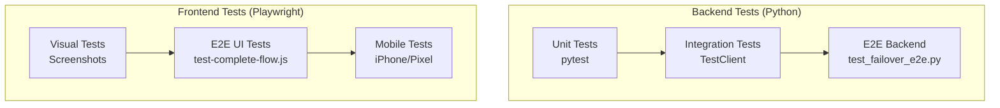

# 🛠️ Development Guide - Dumont Cloud

## Visão Geral do Ambiente de Desenvolvimento

O Dumont Cloud possui **3 modos de operação** para facilitar o desenvolvimento e testes:

### 1. **Modo Demo** (Testes de Interface)
- **Propósito**: Testar a interface sem credenciais reais
- **Como ativar**: `DEMO_MODE=true` ou acesse `/demo-app`
- **Dados**: Máquinas fictícias (RTX 4090, A100, RTX 3090)
- **APIs**: Retornam JSON mock sem chamar provedores reais

### 2. **Modo Local** (Desenvolvimento)
- **Propósito**: Desenvolvimento com hot-reload
- **Backend**: `uvicorn --reload` (porta 8766)
- **Frontend**: `npm run dev` (porta 5173)
- **Database**: PostgreSQL local

### 3. **Modo Produção**
- **Propósito**: Deploy em servidor
- **Backend**: Gunicorn + workers (porta 8766)
- **Frontend**: Build estático servido por Nginx
- **Database**: PostgreSQL remoto

---

## 🎭 Demo Mode (Testes de Interface)

### Como Funciona

O **Demo Mode** injeta dados fictícios em toda a aplicação:

```python
# src/core/config.py
class AppSettings(BaseSettings):
    demo_mode: bool = Field(default=False, env="DEMO_MODE")
```

```python
# src/api/v1/dependencies.py
def get_current_user_optional(demo_param: bool = Query(False)):
    if settings.app.demo_mode or demo_param:
        # Retorna usuário demo
        return User(
            id="demo-user-123",
            email="demo@dumontcloud.com",
            name="Demo User"
        )
```

### Ativando Demo Mode

**Opção 1: Variável de Ambiente**
```bash
DEMO_MODE=true python -m uvicorn src.main:app --port 8766
```

**Opção 2: URL Parameter**
```
http://localhost:8766/api/machines?demo=true
```

**Opção 3: Rota Dedicada**
```
http://localhost:8766/demo-app
```

### Dados Demo Disponíveis

| Recurso | Dados Fictícios |
|---------|-----------------|
| **Máquinas** | RTX 4090 ($0.40/h), A100 ($1.20/h), RTX 3090 ($0.30/h) |
| **Status** | "running", "hibernating", "stopped" |
| **Regiões** | US-East, EU-West, Asia-Pacific |
| **Usuário** | demo@dumontcloud.com |
| **Créditos** | $1,000.00 |

### Exemplo de Resposta Demo

```bash
curl http://localhost:8766/api/machines?demo=true
```

```json
{
  "machines": [
    {
      "id": "demo-rtx4090",
      "name": "ML Training Rig",
      "gpu_name": "RTX 4090",
      "status": "running",
      "cost_per_hour": 0.40,
      "region": "US-East",
      "uptime_hours": 12.5
    }
  ]
}
```

---

## 🧪 Sistema de Testes

### Arquitetura de Testes



### 1. Testes de Backend (Python)

Localizados em `/tests/backend/`

#### Estrutura

```
tests/
├── backend/
│   ├── auth/
│   │   └── test_login.py          # Autenticação JWT
│   ├── instances/
│   │   └── test_gpu_instances.py  # CRUD de instâncias
│   ├── hibernation/
│   │   └── test_auto_hibernation.py  # Auto-sleep
│   ├── snapshots/
│   │   └── test_snapshots.py      # Backup/restore
│   └── e2e/
│       └── test_complete_system_flow.py  # Fluxo completo
```

#### Executando

```bash
# Todos os testes
pytest tests/backend/

# Teste específico
pytest tests/backend/auth/test_login.py -v

# Com cobertura
pytest tests/backend/ --cov=src --cov-report=html

# Apenas testes marcados como "fast"
pytest -m fast
```

#### Exemplo de Teste

```python
# tests/backend/auth/test_login.py
def test_login_success(client):
    response = client.post("/api/auth/login", json={
        "email": "user@example.com",
        "password": "senha123"
    })
    assert response.status_code == 200
    assert "access_token" in response.json()
```

### 2. Testes E2E com Playwright (JavaScript)

Localizados na raiz: `test-*.js` e `/tests/*.spec.js`

#### Playwright Config

```javascript
// playwright.config.js
module.exports = defineConfig({
  testDir: './tests',
  use: {
    baseURL: 'http://localhost:5173',
    headless: true,  // Sem interface gráfica
    screenshot: 'only-on-failure',
    video: 'retain-on-failure',
  },
  projects: [
    { name: 'chromium' },
    { name: 'firefox' },
    { name: 'Mobile Chrome', use: devices['Pixel 5'] },
  ],
});
```

#### Executando

```bash
# Todos os testes E2E
npx playwright test

# Modo headed (visual)
npx playwright test --headed

# Apenas Chromium
npx playwright test --project=chromium

# Teste específico
npx playwright test tests/test_login_flow.spec.js

# Debug mode
npx playwright test --debug
```

#### Exemplo de Teste E2E

```javascript
// tests/test_login_flow.spec.js
const { test, expect } = require('@playwright/test');

test('deve fazer login e criar instância', async ({ page }) => {
  // 1. Login
  await page.goto('http://localhost:5173/login');
  await page.fill('[name="email"]', 'user@example.com');
  await page.fill('[name="password"]', 'senha123');
  await page.click('button[type="submit"]');
  
  // 2. Aguardar redirect
  await expect(page).toHaveURL(/.*dashboard/);
  
  // 3. Criar instância
  await page.click('text=Nova Instância');
  await page.selectOption('[name="gpu"]', 'RTX 4090');
  await page.click('text=Criar');
  
  // 4. Verificar sucesso
  await expect(page.locator('text=Instância criada')).toBeVisible();
});
```

### 3. Testes Visuais (Screenshots)

Os testes Playwright capturam **screenshots automáticos**:

- **Sucesso**: Não gera screenshot (economia de espaço)
- **Falha**: Screenshot salvo em `test-results/`
- **Vídeo**: Gravado apenas se teste falhar

#### Forçar Screenshot

```javascript
test('captura tela do dashboard', async ({ page }) => {
  await page.goto('/dashboard');
  await page.screenshot({ path: 'screenshots/dashboard.png' });
});
```

---

## 📂 Estrutura de Arquivos de Teste

### Backend Tests

```bash
# Ver todos os testes Python
find tests/backend -name "test_*.py"

# Executar apenas testes de autenticação
pytest tests/backend/auth/
```

### Frontend Tests

```bash
# Ver todos os testes Playwright
find . -name "test*.js" -o -name "*.spec.js"

# Executar teste completo
npx playwright test test-complete-flow.js
```

---

## 🔍 Debug de Testes

### Backend (Python)

```bash
# Executar com print() habilitado
pytest tests/backend/auth/ -s

# Parar no primeiro erro
pytest tests/backend/ -x

# Entrar no debugger em falhas
pytest tests/backend/ --pdb
```

### Frontend (Playwright)

```bash
# Modo interativo (Playwright Inspector)
npx playwright test --debug

# Slow motion (para ver ações)
npx playwright test --slow-mo=500

# Ver relatório HTML
npx playwright show-report
```

---

## ⚡ CI/CD Integration

### GitHub Actions (Exemplo)

```yaml
name: Tests
on: [push, pull_request]

jobs:
  backend:
    runs-on: ubuntu-latest
    steps:
      - uses: actions/checkout@v3
      - uses: actions/setup-python@v4
      - run: pip install -r requirements.txt
      - run: pytest tests/backend/ --cov=src

  frontend:
    runs-on: ubuntu-latest
    steps:
      - uses: actions/checkout@v3
      - uses: actions/setup-node@v3
      - run: npm ci
      - run: npx playwright install
      - run: npx playwright test
```

---

## 📊 Coverage Reports

### Backend

```bash
# Gerar relatório HTML
pytest tests/backend/ --cov=src --cov-report=html

# Abrir no navegador
open htmlcov/index.html
```

**Meta de Cobertura**: >80%

### Frontend

```bash
# Com Playwright (visual coverage)
npx playwright test --reporter=html

# Ver relatório
npx playwright show-report
```

---

## 🛡️ Boas Práticas

### 1. Sempre rodar testes antes de commit

```bash
# Pre-commit hook (.git/hooks/pre-commit)
#!/bin/bash
pytest tests/backend/ -x || exit 1
npx playwright test || exit 1
```

### 2. Usar fixtures para reutilizar setup

```python
# conftest.py
@pytest.fixture
def authenticated_client():
    client = TestClient(app)
    token = get_test_token()
    client.headers = {"Authorization": f"Bearer {token}"}
    return client
```

### 3. Separar testes por velocidade

```python
# Testes rápidos
@pytest.mark.fast
def test_login():
    ...

# Testes lentos (E2E)
@pytest.mark.slow
def test_failover_complete():
    ...
```

---

## 🎨 Design System & UI Template

### Template Base: TailAdmin Dark

O Dumont Cloud utiliza componentes inspirados no **TailAdmin**, um template gratuito e open-source.

| Propriedade | Valor |
|-------------|-------|
| **Template** | TailAdmin Dark |
| **Website** | https://tailadmin.com/ |
| **Demo** | https://demo.tailadmin.com/ |
| **GitHub** | https://github.com/TailAdmin/free-react-tailwind-admin-dashboard |
| **Licença** | MIT (Free) |
| **Stack** | React + Tailwind CSS |

### Por que TailAdmin?

1. **Dark Theme Nativo** - Combina com nossa identidade visual
2. **Tailwind CSS** - Mesmo stack do Dumont Cloud
3. **Componentes Prontos** - Cards, tables, forms, charts
4. **React-Based** - Fácil integração
5. **Open Source** - Sem custos de licença

### Paleta de Cores Dumont Cloud

```css
/* Cores principais - Extraídas da interface Dumont Cloud */
:root {
  /* Backgrounds */
  --bg-primary: #0e110e;      /* Fundo principal da página */
  --bg-secondary: #131713;    /* Cards, containers, wizard */
  --bg-tertiary: #1a1f1a;     /* Hover states, tabs inativas */
  --bg-card-dark: #1c211c;    /* Fundo do mapa */

  /* Accent Green (Principal) */
  --accent-green: #4ade80;    /* Verde principal - textos, ícones */
  --accent-green-dark: #22c55e; /* Verde secundário */
  --accent-green-glow: rgba(74, 222, 128, 0.2); /* Glow/gradient */

  /* Status Colors */
  --status-online: #4ade80;   /* Verde - Online/Running */
  --status-offline: #6b7280;  /* Cinza - Offline/Stopped */
  --status-warning: #f59e0b;  /* Amarelo - Warning */
  --status-error: #ef4444;    /* Vermelho - Error */

  /* Tier Colors (Velocidade & Custo) */
  --tier-slow: #22c55e;       /* Lento - Verde */
  --tier-medium: #84cc16;     /* Médio - Lima */
  --tier-fast: #f97316;       /* Rápido - Laranja */
  --tier-ultra: #ef4444;      /* Ultra - Vermelho */

  /* Borders */
  --border-subtle: #2a352a;   /* Bordas sutis */
  --border-card: rgba(55, 65, 55, 0.5); /* Bordas de cards */

  /* Text */
  --text-primary: #ffffff;    /* Texto principal */
  --text-secondary: #9ca3af;  /* Texto secundário */
  --text-muted: #6b7280;      /* Texto apagado */

  /* Buttons */
  --btn-primary: #4a5d4a;     /* Botão primário (Wizard, tabs) */
  --btn-primary-hover: #5a6d5a; /* Hover do botão */
  --btn-cta: linear-gradient(to right, #22c55e, #4ade80); /* CTA principal */
}
```

### Elementos Visuais Específicos

| Elemento | Cor | Uso |
|----------|-----|-----|
| **Mapa Fundo** | `#1c211c` | Background do mapa mundial |
| **Mapa Dots** | `#2a352a` | Grid de pontos decorativos |
| **Região Ativa** | `#22c55e` | País selecionado no mapa |
| **Marker Glow** | `#4ade80` com pulse | Indicador de região |
| **Tab Ativa** | `#4a5d4a` | Background da tab selecionada |
| **Tab Inativa** | transparente | Apenas texto cinza |
| **Card Selected** | `border-green-500` | Borda verde quando selecionado |
| **Slider Track** | gradient verde→vermelho | Barra de velocidade/economia |
| **CTA Button** | gradient `#22c55e → #4ade80` | "Buscar Máquinas Disponíveis" |

### Gradientes Utilizados

```css
/* Slider de Velocidade & Custo */
.speed-slider {
  background: linear-gradient(to right,
    #22c55e 0%,      /* Economia (verde) */
    #84cc16 33%,     /* Médio (lima) */
    #f97316 66%,     /* Rápido (laranja) */
    #ef4444 100%     /* Ultra (vermelho) */
  );
}

/* Cards de Stats */
.stat-card-green {
  background: linear-gradient(to bottom-right,
    rgba(34, 197, 94, 0.2),
    rgba(74, 222, 128, 0.2)
  );
  border-color: rgba(34, 197, 94, 0.3);
}

/* Botão CTA Principal */
.btn-cta {
  background: linear-gradient(to right, #22c55e, #4ade80);
}
```

### Componentes Utilizados

| Componente | Origem | Customização |
|------------|--------|--------------|
| **StatCard** | TailAdmin | Cores verdes, tooltips |
| **DataTable** | TailAdmin | Filtros, ações inline |
| **Sidebar** | TailAdmin | Dropdown Analytics |
| **Forms** | Shadcn UI | Inputs, selects |
| **Charts** | Recharts | Paleta dark |
| **Map** | react-simple-maps | Estilo dark |

### Como Adicionar Novos Componentes

1. Buscar componente no TailAdmin Demo
2. Copiar estrutura base
3. Aplicar paleta de cores Dumont
4. Adicionar em `web/src/components/`

```jsx
// Exemplo: Adaptando um card do TailAdmin
const CustomCard = ({ title, value, icon }) => (
  <div className="p-4 rounded-xl border bg-gradient-to-br
                  from-green-500/20 to-green-600/20
                  border-green-500/30">
    <Icon className="w-5 h-5 text-green-400" />
    <div className="text-2xl font-bold text-white">{value}</div>
    <div className="text-xs text-gray-400">{title}</div>
  </div>
);
```

### Recursos do TailAdmin

- **Documentação**: https://tailadmin.com/docs
- **Componentes**: https://tailadmin.com/components
- **Figma**: Disponível na versão Pro

---

## 🧩 Dumont UI - Componentes Disponíveis

Componentes adaptados do TailAdmin para Dumont Cloud, localizados em `web/src/components/ui/`.

### Import Central

```jsx
// Importar todos os componentes de uma vez
import {
  Badge, StatusBadge, TrendBadge,
  Alert, AlertInline, ToastAlert,
  Table, TableHeader, TableBody, TableRow, TableHead, TableCell,
  Modal, ModalHeader, ModalBody, ModalFooter, ConfirmModal,
  MetricCard, MetricsGrid, MiniMetric,
} from '../components/ui/dumont-ui';
```

### Badge Component

```jsx
import Badge, { StatusBadge, TrendBadge } from '../components/ui/badge-dumont';

// Badge básico
<Badge color="success">Online</Badge>
<Badge color="error" variant="solid">Erro</Badge>

// Status de máquina
<StatusBadge status="running" />   // Verde "Online"
<StatusBadge status="stopped" />   // Cinza "Offline"
<StatusBadge status="hibernating" /> // Amarelo "Hibernando"

// Trend (métricas)
<TrendBadge value={11} />   // ↑ 11% (verde)
<TrendBadge value={-5} />   // ↓ 5% (vermelho)
```

### Alert Component

```jsx
import Alert, { AlertInline, ToastAlert } from '../components/ui/alert-dumont';

// Alert completo
<Alert
  variant="success"
  title="Sucesso!"
  message="Máquina iniciada com sucesso."
  dismissible
  onDismiss={() => {}}
/>

// Alert inline (compacto)
<AlertInline variant="warning">Atenção: recurso em beta</AlertInline>

// Toast notification
<ToastAlert
  variant="success"
  title="Salvo"
  message="Configurações atualizadas"
  onClose={() => {}}
/>
```

### Table Component

```jsx
import { Table, TableHeader, TableBody, TableRow, TableHead, TableCell } from '../components/ui/table-dumont';

<Table>
  <TableHeader>
    <TableRow hoverable={false}>
      <TableHead>Nome</TableHead>
      <TableHead>Status</TableHead>
      <TableHead align="right">Custo</TableHead>
    </TableRow>
  </TableHeader>
  <TableBody>
    <TableRow onClick={() => console.log('clicked')}>
      <TableCell>RTX 4090</TableCell>
      <TableCell><StatusBadge status="running" /></TableCell>
      <TableCell align="right">$0.40/h</TableCell>
    </TableRow>
  </TableBody>
</Table>
```

### Modal Component

```jsx
import { Modal, ModalBody, ModalFooter, ConfirmModal } from '../components/ui/modal-dumont';

// Modal completo
<Modal isOpen={open} onClose={() => setOpen(false)} title="Configurações" size="lg">
  <ModalBody>
    <p>Conteúdo do modal</p>
  </ModalBody>
  <ModalFooter>
    <button className="dumont-btn dumont-btn-ghost">Cancelar</button>
    <button className="dumont-btn dumont-btn-cta">Salvar</button>
  </ModalFooter>
</Modal>

// Modal de confirmação
<ConfirmModal
  isOpen={confirmOpen}
  onClose={() => setConfirmOpen(false)}
  onConfirm={() => deleteMachine()}
  title="Excluir máquina?"
  message="Esta ação não pode ser desfeita."
  variant="danger"
/>
```

### MetricCard Component

```jsx
import { MetricCard, MetricsGrid, MiniMetric } from '../components/ui/metric-card';

<MetricsGrid columns={4}>
  <MetricCard
    icon={Server}
    title="Máquinas Ativas"
    value="2/3"
    color="green"
    tooltip="Total de GPUs rodando vs contratadas"
  />
  <MetricCard
    icon={DollarSign}
    title="Economia"
    value="$724"
    color="purple"
    trend={89}
    animate={true}
    comparison="vs AWS: $6,547"
  />
</MetricsGrid>

// Mini metric (inline)
<MiniMetric label="GPU Usage" value="93%" trend={5} color="green" />
```

### CSS Classes Disponíveis

```html
<!-- Cards -->
<div class="dumont-card">Conteúdo</div>

<!-- Botões -->
<button class="dumont-btn dumont-btn-primary">Primary</button>
<button class="dumont-btn dumont-btn-cta">CTA (Gradient)</button>
<button class="dumont-btn dumont-btn-outline">Outline</button>
<button class="dumont-btn dumont-btn-ghost">Ghost</button>

<!-- Animações -->
<div class="animate-modal-in">Modal com fade</div>
<div class="animate-slide-up">Toast subindo</div>
<div class="animate-pulse-glow">Pulsando verde</div>
<div class="animate-shimmer">Loading shimmer</div>
```

### CSS Variables

```css
/* Usar em CSS customizado */
.meu-componente {
  background: var(--dumont-bg-secondary);
  border-color: var(--dumont-border);
  color: var(--dumont-green);
}
```

---

**Próximos passos**: Leia [Testing Guide](Testing_Guide.md) para casos avançados
