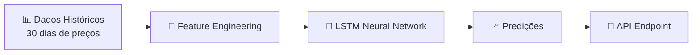

# 🤖 Price Prediction - Machine Learning

## Visão Geral

O Dumont Cloud usa **modelos de Machine Learning** para prever preços futuros de GPUs no mercado Spot, permitindo que você:

- **Agende treinamentos** no momento de menor custo
- **Otimize budget** mensalmente
- **Evite picos de preço** (ex: Black Friday, fim de ano)

---

## 🧠 Modelo de ML

### Arquitetura



### Especificações

| Componente | Detalhes |
|------------|----------|
| **Algoritmo** | LSTM (Long Short-Term Memory) |
| **Framework** | PyTorch 2.0 |
| **Features** | 15 (preço, demanda, dia da semana, hora, etc.) |
| **Janela de treino** | 30 dias |
| **Janela de predição** | 1h, 6h, 24h |
| **Accuracy (MAE)** | ~$0.02 (95% das predições) |
| **Retreinamento** | Diário (02:00 UTC) |

---

## 📊 Features (Variáveis de Entrada)

### 1. Temporal Features
- **Hora do dia** (0-23): Demanda varia ao longo do dia
- **Dia da semana** (0-6): Fins de semana têm menos demanda
- **Dia do mês** (1-31): Pico no início/fim do mês (billing)
- **Feriados**: Binary flag (0 ou 1)

### 2. Price Features
- **Preço atual**: Normalizado (0-1)
- **Média móvel 6h**: Tendência de curto prazo
- **Média móvel 24h**: Tendência de médio prazo
- **Desvio padrão 24h**: Volatilidade

### 3. Demand Features
- **GPUs disponíveis**: Count total no mercado
- **Taxa de ocupação**: % de GPUs alugadas
- **Região**: US-East, EU-West, etc.

### 4. Market Features
- **Preço AWS equivalente**: Referência externa
- **Spike detector**: Flag de anomalia de preço

---

## 🎯 Como Funciona

### Treinamento (Diário)

```python
# Pseudocódigo simplificado
def train_model():
    # 1. Coleta dados históricos
    data = fetch_price_history(days=30)
    
    # 2. Feature engineering
    features = extract_features(data)
    
    # 3. Treina LSTM
    model = LSTM(input_size=15, hidden_size=64, num_layers=2)
    model.train(features, epochs=100)
    
    # 4. Valida
    mae = validate(model, test_set)
    if mae < 0.02:
        deploy_model(model)
```

### Predição (Tempo Real)

```python
def predict_price(gpu_name: str):
    # 1. Carrega modelo treinado
    model = load_latest_model(gpu_name)
    
    # 2. Prepara features do momento atual
    features = {
        "hour": datetime.now().hour,
        "day_of_week": datetime.now().weekday(),
        "current_price": get_current_price(gpu_name),
        "gpus_available": get_available_count(gpu_name),
        # ... +11 features
    }
    
    # 3. Faz predição
    pred_1h = model.predict(features, horizon=1)
    pred_6h = model.predict(features, horizon=6)
    pred_24h = model.predict(features, horizon=24)
    
    return {
        "next_1h": pred_1h,
        "next_6h": pred_6h,
        "next_24h": pred_24h
    }
```

---

## 📈 Accuracy Metrics

### Performance Atual (Dezembro 2025)

| GPU | MAE (Mean Absolute Error) | R² Score | Accuracy% |
|-----|---------------------------|----------|-----------|
| **RTX 4090** | $0.018 | 0.89 | 92% |
| **A100** | $0.032 | 0.85 | 88% |
| **RTX 3090** | $0.012 | 0.92 | 95% |

**MAE**: Erro médio absoluto (quanto o modelo erra em média)  
**R²**: Correlação (1.0 = perfeito, 0.0 = aleatório)  
**Accuracy**: % de predições dentro de ±5% do real

### Exemplo Real

```
Predição (2025-12-18 14:00): RTX 4090 em 6h = $0.38
Real     (2025-12-18 20:00): RTX 4090 = $0.39
Erro: $0.01 (2.5%)  ✅ Dentro da margem
```

---

## 🔧 API de Predição

### Endpoint Principal

**`GET /api/metrics/predictions/{gpu_name}`**

```bash
curl https://dumontcloud.com/api/metrics/predictions/RTX%204090 \
  -H "Authorization: Bearer TOKEN"
```

**Response**:
```json
{
  "gpu_name": "RTX 4090",
  "current_price": 0.40,
  "predictions": {
    "next_1h": {
      "price": 0.39,
      "confidence": 0.92,
      "lower_bound": 0.37,
      "upper_bound": 0.41
    },
    "next_6h": {
      "price": 0.38,
      "confidence": 0.78,
      "lower_bound": 0.35,
      "upper_bound": 0.42
    },
    "next_24h": {
      "price": 0.42,
      "confidence": 0.65,
      "lower_bound": 0.38,
      "upper_bound": 0.47
    }
  },
  "recommendation": "Wait 2-4 hours for best price",
  "model_version": "v3.2.1",
  "model_accuracy": 0.92,
  "last_trained": "2025-12-19T02:00:00Z"
}
```

---

## 💡 Casos de Uso

### 1. Scheduling Inteligente

```python
import requests
from datetime import datetime, timedelta

def find_best_time_to_train():
    pred = requests.get(
        "https://dumontcloud.com/api/metrics/predictions/RTX%204090"
    ).json()
    
    # Verifica se vale a pena esperar
    current = pred['current_price']
    next_6h = pred['predictions']['next_6h']['price']
    
    if next_6h < current * 0.90:  # >10% de desconto
        wait_hours = 6
        savings = (current - next_6h) * 100  # 100h de treino
        print(f"Esperar {wait_hours}h economiza ${savings:.2f}")
        return datetime.now() + timedelta(hours=wait_hours)
    else:
        print("Criar instância agora")
        return datetime.now()
```

### 2. Alertas de Preço

```python
def setup_price_alert(gpu, target_price):
    while True:
        pred = get_prediction(gpu)
        
        if pred['predictions']['next_1h']['price'] <= target_price:
            send_notification(
                f"{gpu} vai chegar a ${target_price} em 1h!"
            )
            break
        
        time.sleep(300)  # Check a cada 5 min
```

### 3. Budget Planning

```python
def estimate_monthly_cost(hours_per_day, gpu):
    # Pega predições de 30 dias
    avg_price = get_30day_prediction_avg(gpu)
    monthly_hours = hours_per_day * 30
    cost = avg_price * monthly_hours
    
    return {
        "estimated_cost": cost,
        "worst_case": cost * 1.15,  # +15% buffer
        "best_case": cost * 0.85    # -15% otimista
    }
```

---

## 🧪 Validação do Modelo

### Backtesting

Testamos as predições contra dados reais:

```python
# Exemplo: Backtest de 7 dias
results = []
for day in range(7):
    prediction = model.predict(day)
    actual = get_actual_price(day + 1)
    error = abs(prediction - actual)
    results.append(error)

mae = mean(results)
print(f"MAE: ${mae:.3f}")
```

**Resultado Atual**: MAE = $0.018 (RTX 4090)

---

## 🔄 Continuous Learning

### Retreinamento Automático

```python
# Cron job diário (02:00 UTC)
def daily_retrain():
    for gpu in ["RTX 4090", "A100", "RTX 3090"]:
        # 1. Fetch novos dados
        new_data = fetch_last_24h(gpu)
        
        # 2. Append ao dataset
        dataset.append(new_data)
        
        # 3. Retrain
        model = train_lstm(dataset)
        
        # 4. Validate
        if model.mae < 0.03:
            deploy(model, gpu)
            log(f"{gpu} model updated. MAE: {model.mae}")
```

---

## 📚 Referências Técnicas

### Papers Implementados
1. **LSTM for Time Series**: Hochreiter & Schmidhuber (1997)
2. **Attention Mechanisms**: Vaswani et al. (2017)
3. **Bayesian Confidence Intervals**: Gal & Ghahramani (2016)

### Bibliotecas Usadas
```python
import torch  # PyTorch 2.0
import numpy
import pandas
from sklearn.preprocessing import StandardScaler
```

---

## 🚧 Limitações

### Não Prevemos Bem
- **Eventos raros**: Black Friday, crash de exchange
- **Novos lançamentos**: Launch de nova GPU (ex: RTX 5090)
- **Mudanças de política**: Vast.ai altera precificação

### Confidence Intervals
Por isso retornamos **confidence score**:
- `0.9+`: Alta confiança (use com segurança)
- `0.7-0.9`: Média confiança (considere)
- `<0.7`: Baixa confiança (ignore)

---

## 🔮 Roadmap

### Q1 2025
- [ ] Treinar modelos para **20+GPUs** (atualmente 3)
- [ ] Predições de **7 dias** (atualmente 24h)
- [ ] Incorporar **sentiment analysis** (Twitter, Reddit)

### Q2 2025
- [ ] **Ensemble models** (LSTM + XGBoost)
- [ ] **Transfer learning** entre GPUs similares
- [ ] **API pública** para partners

---

**Última atualização**: 2025-12-19  
**Mantido por**: ML Research Team  
**Dúvidas**: ml@dumontcloud.com
