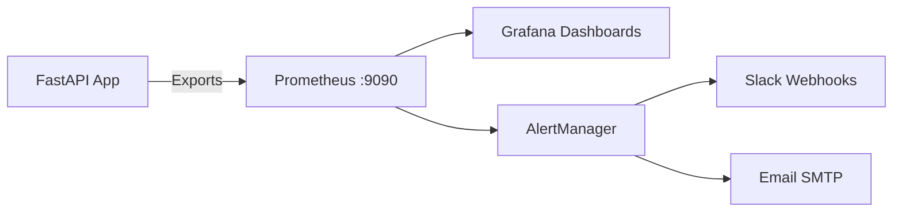

# 📊 Monitoring - Dumont Cloud

## Stack de Observabilidade



---

## 📈 Métricas Principais (Prometheus)

### 1. Sistema

```promql
# CPU Usage por instância
rate(process_cpu_seconds_total[5m]) * 100

# Memória usada
process_resident_memory_bytes / 1024 / 1024

# Requests por segundo
rate(http_requests_total[1m])
```

### 2. Negócio

```promql
# Total de instâncias ativas
dumont_instances_active

# Economia total (USD)
dumont_savings_total_usd

# GPU utilization média
avg(dumont_gpu_utilization_percent)

# Taxa de failover por hora
rate(dumont_failover_events_total[1h])
```

### 3. Performance

```promql
# Tempo médio de resposta API
histogram_quantile(0.95, rate(http_request_duration_seconds_bucket[5m]))

# Snapshot speed (GB/s)
dumont_snapshot_upload_speed_gbps

# Latência sync (ms)
dumont_sync_latency_milliseconds
```

---

## 🚨 Alertas Críticos (AlertManager)

### Configuração `/etc/alertmanager/rules.yml`

```yaml
groups:
  - name: dumont_critical
    interval: 30s
    rules:
      # 1. Instance down
      - alert: InstanceDown
        expr: up == 0
        for: 2m
        labels:
          severity: critical
        annotations:
          summary: "Instance {{ $labels.instance }} is down"
          
      # 2. Custo alto inesperado
      - alert: HighBurnRate
        expr: rate(dumont_cost_total_usd[1h]) > 5
        for: 5m
        labels:
          severity: warning
        annotations:
          summary: "Burn rate > $5/hour"
          
      # 3. Disco cheio
      - alert: DiskFull
        expr: (node_filesystem_avail_bytes / node_filesystem_size_bytes) < 0.1
        for: 5m
        labels:
          severity: critical
        annotations:
          summary: "Disk < 10% free on {{ $labels.instance }}"
          
      # 4. Failover frequente
      - alert: FrequentFailovers
        expr: rate(dumont_failover_events_total[1h]) > 3
        for: 10m
        labels:
          severity: warning
        annotations:
          summary: ">3 failovers in 1 hour - investigate Vast.ai stability"
          
      # 5. Snapshot falha
      - alert: SnapshotFailure
        expr: increase(dumont_snapshot_failures_total[10m]) > 0
        for: 1m
        labels:
          severity: high
        annotations:
          summary: "Snapshot failed for {{ $labels.instance_id }}"
```

---

## 📱 Integração Slack

### Webhook Config

```python
# src/services/alert_service.py
import requests

SLACK_WEBHOOK = "https://hooks.slack.com/services/YOUR/WEBHOOK"

def send_alert(title, message, severity="info"):
    color = {
        "critical": "#FF0000",
        "high": "#FF6600",
        "warning": "#FFCC00",
        "info": "#00CC00"
    }[severity]
    
    payload = {
        "attachments": [{
            "color": color,
            "title": f"🔔 {title}",
            "text": message,
            "footer": "Dumont Cloud Monitoring",
            "ts": int(time.time())
        }]
    }
    
    requests.post(SLACK_WEBHOOK, json=payload)
```

### Exemplo de Alerta no Slack

```
🔔 High Burn Rate Detected
Burn rate is $6.50/hour (threshold: $5/hour)
Instance: 28864630 (RTX 4090)
Action: Auto-hibernate triggered
```

---

## 📊 Dashboards Grafana

### Dashboard 1: Instance Health

**Painéis**:
1. **Instâncias Ativas** (Gauge)
2. **GPU Utilization** (Line Chart)
3. **Custo Acumulado** (Area Chart)
4. **Failovers Hoje** (Stat)

**Query PromQL**:
```promql
# Painél 1
sum(dumont_instances_active)

# Painél 2
avg(dumont_gpu_utilization_percent) by (instance_id)

# Painél 3
sum(rate(dumont_cost_total_usd[5m])) * 60

# Painél 4
increase(dumont_failover_events_total[24h])
```

### Dashboard 2: Savings Overview

**Painéis**:
1. **Total Economizado (Mês)** (Big Number)
2. **ROI %** (Gauge)
3. **Comparação AWS vs Dumont** (Bar Chart)
4. **Auto-Hibernation Savings** (Pie Chart)

---

## 🔍 Logs Centralizados

### Estrutura de Logs

```json
{
  "timestamp": "2025-12-19T02:30:00Z",
  "level": "info",
  "service": "instance_service",
  "event": "gpu_created",
  "instance_id": "28864630",
  "gpu_type": "RTX 4090",
  "region": "US-East",
  "cost_per_hour": 0.40
}
```

### Query Úteis

```bash
# Ver últimos 100 logs
tail -n 100 /var/log/dumont-cloud/app.log

# Filtrar por erro
grep "ERROR" /var/log/dumont-cloud/app.log

# Logs de um instance específico
grep "instance_id\":\"28864630" /var/log/dumont-cloud/app.log | jq .
```

---

## 🧪 Health Checks

### Endpoint `/health`

```bash
curl https://dumontcloud.com/health
```

**Response**:
```json
{
  "status": "healthy",
  "database": "ok",
  "redis": "ok",
  "vast_api": "ok",
  "gcp_api": "ok",
  "uptime_seconds": 864000
}
```

### Nagios/Zabbix Integration

```bash
# Check script
#!/bin/bash
STATUS=$(curl -s https://dumontcloud.com/health | jq -r '.status')
if [ "$STATUS" != "healthy" ]; then
  echo "CRITICAL: Dumont Cloud unhealthy"
  exit 2
fi
echo "OK: Dumont Cloud healthy"
exit 0
```

---

## 📞 Rotina de On-Call

### SLA Targets
- **Uptime**: 99.9% (downtime máximo: 43min/mês)
- **Response Time (P95)**: <300ms
- **Failover Time**: <5s

### Playbook de Incidentes

1. **Alerta recebido (Slack/Email)** → Verificar dashboard Grafana
2. **Severidade Critical** → Acordar dev on-call (PagerDuty)
3. **Análise inicial** → Checar logs + métricas
4. **Mitigação** → Restart service / failover manual
5. **Post-mortem** → Documentar causa raiz + ação preventiva

---

**Dashboards Prontos**: `dashboards/grafana/*.json`  
**Última atualização**: 2025-12-19
