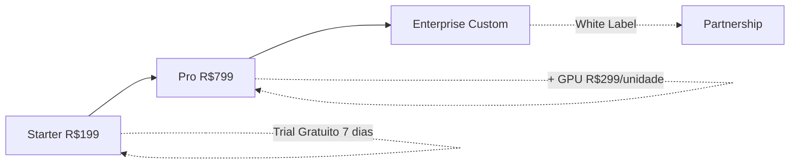

# 💰 Estratégia de Preços - Dumont Cloud

## Modelo de Precificação

### Tier 1: **Starter** (Para Desenvolvedores)
- **Preço**: R$ 199/mês
- **Limites**: 1 GPU ativa, 50GB storage, 100h/mês
- **Ideal para**: Projetos pessoais, prototipagem, testes
- **Economia vs AWS**: ~87%

### Tier 2: **Pro** (Para Startups)
- **Preço**: R$ 799/mês
- **Limites**: 3 GPUs ativas, 500GB storage, ilimitado
- **Recursos**: Auto-hibernação, Snapshots automáticos, Suporte prioritário
- **Economia vs AWS**: ~89%

### Tier 3: **Enterprise** (Para Empresas)
- **Preço**: Custom (a partir de R$ 2.999/mês)
- **Limites**: Ilimitado
- **Recursos**: SLA 99.9%, Suporte 24/7, GPU dedicadas, Multi-região
- **Economia vs AWS**: ~85% (volume alto)

---

## 📊 Calculadora de ROI

### Exemplo Real (Startup de IA)

| Provider | GPU (RTX 4090) | Custo/Hora | Custo/Mês (300h) | Economia |
|----------|----------------|------------|------------------|----------|
| **AWS EC2** | p3.2xlarge | $3.06 | $918 (~R$ 4,590) | - |
| **GCP** | n1-highmem-8 + GPU | $2.48 | $744 (~R$ 3,720) | 19% |
| **Dumont Pro** | RTX 4090 Spot | - | **R$ 799** | **83%** |

### Break-even em 3 dias
Com economia de R$ 3,791/mês, o investimento inicial se paga em menos de uma semana.

---

## 🎯 Proposta de Valor por Segmento

### Desenvolvedores Solo
- **Dor**: AWS custa R$ 500+ só para testar modelo
- **Solução**: Starter com auto-hibernação = R$ 199 fixo
- **Ganho**: Orçamento previsível

### Startups (Seed/Series A)
- **Dor**: Burnrate alto em infra, precisa escalar rápido
- **Solução**: Pro com snapshots + failover automático
- **Ganho**: Reduz custos em 80%, tem resiliência enterprise

### Empresas
- **Dor**: Vendor lock-in, SLA fraco, suporte lento
- **Solução**: Enterprise com GPU dedicada + SLA 99.9%
- **Ganho**: Controle total, compliance, economia de escala

---

## 📈 Upsell Path

---

## 🔥 Táticas de Conversão

1. **Trial Reverso**: Começa no Pro (7 dias), depois downgrade para Starter se quiser
2. **Savings Badge**: Dashboard mostra economia em tempo real vs AWS
3. **Referral**: Indica amigo = R$ 100 de crédito
4. **Annual Discount**: 2 meses grátis (16% off)

---

## 💡 Gatilhos de Upgrade

| Evento | Proposta |
|--------|----------|
| Usuário usa >80h no Starter | Email: "Upgrade para Pro = uso ilimitado" |
| 3+ snapshots criados | "Pro tem snapshot automático" |
| Downtime >10min | "Enterprise tem failover instantâneo" |

---

**Última atualização**: 2025-12-19  
**Owner**: Marketing & Growth Team
