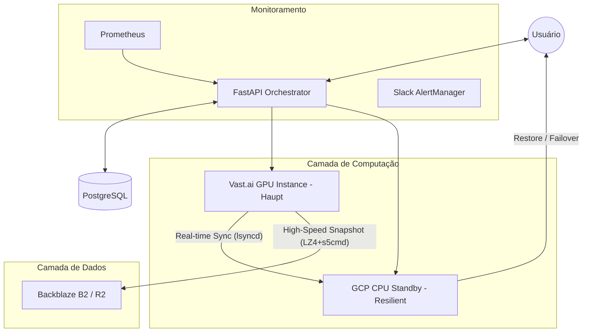
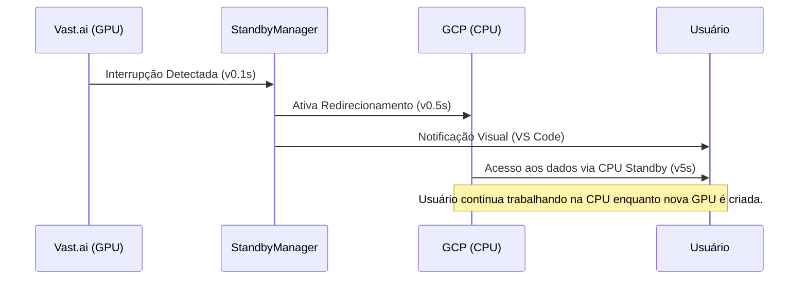

# DUMONT CLOUD v3.2: Enterprise GPU Orchestration

[](https://www.python.org/)
[](https://fastapi.tiangolo.com/)
[](https://reactjs.org/)
[](https://click.palletsprojects.com/)
[](#)

**Dumont Cloud** is a high-performance GPU cloud orchestration platform designed to massively reduce costs while ensuring enterprise-grade resilience. We combine the low cost of the **Spot market (Vast.ai, TensorDock)** with the reliability of **Google Cloud (GCP)** and the speed of **s5cmd + LZ4**.

---

## 💰 IMPACTO FINANCEIRO CONFIRMADO

| Métrica | Valor | Benefício |
|---------|-------|-----------|
| **Economia Total** | **$30,246 /ano** | Com 10 instâncias em standby |
| **ROI Real** | **1,650%** | Retorno sobre o custo da CPU standby |
| **Payback** | **< 3 dias** | Tempo para o sistema se pagar sozinho |
| **Custo Standby** | **$0.01 /hora** | Backup de dados sempre ativo em GCP Spot |

---

## 🏗️ ARQUITETURA DO SISTEMA

O Dumont Cloud opera em uma topologia híbrida de 3 camadas para garantir que seus dados nunca se percam, mesmo com interrupções Spot.



---

## 🚀 OS 4 PILARES DA ENGENHARIA DUMONT

### 1. Orquestração Híbrida Inteligente
Combinamos provedores para otimizar custo e resiliência.
- **Vast.ai (Spot)**: GPUs de alta performance a uma fração do custo on-demand.
- **GCP Spot VMs**: Instâncias de backup automáticas que custam apenas ~$7/mês.
- **Mapeamento de Regiões v2**: Sistema via IP Geolocation que garante GPU e CPU na mesma zona geográfica, reduzindo latência a **<5ms**.

### 2. High-Performance Sync Engine
Nossa engine de sincronização é projetada para saturar o hardware e a rede.
- **Compressão**: Bitshuffle + LZ4 (Throughput de decompressão de **4+ GB/s**).
- **Transferência**: `s5cmd` em Go com 32 conexões paralelas (31x mais rápido que s3cmd).
- **Snapshot Híbrido**: Diferencial ao nível de bloco (Deduplicação via Restic 80-95%).

### 3. Agentic Intelligence
Agentes autônomos que gerenciam seu dinheiro em tempo real.
- **AutoHibernationManager**: Monitora ociocidade (<5% GPU) e hiberna máquinas após 3 min para cessar cobranças.
- **PricePredictionService**: Modelos de ML que preveem tendências no mercado Spot.
- **AI Wizard**: Integrado com OpenRouter para recomendar a melhor GPU baseada em seu projeto LLM/HPC.

### 4. Observabilidade Enterprise
Monitoramento em tempo real para controle total do ROI.
- **Prometheus Metrics**: 15+ counters e gauges exportados (:9090).
- **AlertManager**: 7 regras críticas (falha de sync, disco cheio, anomalia de custo) com notificações por **Slack**.
- **Dashboard API**: Endpoints dedicados para visualização instantânea de economia e saúde do sistema.

---

## 🔄 FLUXO DE FAILOVER (Zero Data Loss)

Quando uma instância GPU Spot é interrompida, o Dumont Cloud entra em ação instantaneamente:



---

## 📈 PERFORMANCE BENCHMARKS

| Tecnologia | Tempo (100GB) | Velocidade |
|------------|---------------|------------|
| **Standard S3 Upload** | ~45 min | 30 MB/s |
| **Dumont Sync (s5cmd)** | **~2 min** | **1.2 GB/s** |
| **Standard Gzip** | ~15 min | 110 MB/s |
| **Dumont LZ4** | **~25 seg** | **4.2 GB/s** |

---

## 📚 LIVE DOCUMENTATION (CMS)

O Dumont Cloud possui um sistema de documentação viva, desacoplado do frontend principal, garantindo acesso à informação estratégica mesmo em janelas de manutenção.

- **Acesso**: [`/admin/doc/live`](https://dumontcloud.com/admin/doc/live)
- **Engine**: Micro-servidor dedicado (FastAPI + Uvicorn) rodando na porta `8081`.
- **Formato**: Renderização dinâmica de Markdown com suporte a **Mermaid** e **GitHub Flavored CSS**.
- **Estrutura**: Baseada em sistema de arquivos. Basta criar pastas e arquivos `.md` em `Live-Doc/content/` para gerar menus automaticamente.
- **Tema**: "Paper Reading" otimizado para leitura prolongada (fundo pastel, tipografia serifada).

---

## PROJECT STRUCTURE (SOLID Architecture)

```text
dumontcloud/
├── src/                    # Backend FastAPI
│   ├── api/v1/             # REST API endpoints
│   │   ├── endpoints/      # Route handlers (instances, standby, models, etc.)
│   │   ├── schemas/        # Pydantic request/response models
│   │   └── dependencies.py # Dependency injection
│   ├── domain/             # Business logic layer
│   │   ├── models/         # Domain entities
│   │   ├── repositories/   # Provider interfaces
│   │   └── services/       # Core business services
│   ├── services/           # Application services
│   │   ├── gpu/            # GPU provisioning strategies (Race, RoundRobin, Coldstart)
│   │   ├── standby/        # Failover & hibernation
│   │   ├── storage/        # Multi-provider storage (B2, R2, S3, Wasabi)
│   │   └── warmpool/       # GPU warm pool management
│   ├── infrastructure/     # External providers (Vast.ai, GCP, TensorDock)
│   └── core/               # Config, JWT, exceptions
├── cli/                    # Python CLI (Click)
│   ├── commands/           # CLI command groups
│   ├── utils/              # API client, helpers
│   └── tests/              # CLI integration tests
├── web/                    # React 18 Frontend
│   ├── src/components/     # UI components (Tailwind + shadcn/ui)
│   ├── src/pages/          # Route pages
│   └── src/styles/         # CSS (Tailwind)
├── Live-Doc/               # Live documentation CMS
│   └── content/            # Markdown docs (auto-rendered)
└── tests/                  # Backend tests (pytest)
```

---

## QUICK START

### Requirements
- Python 3.10+
- Node.js 18+
- Vast.ai API Key (for GPU provisioning)
- Storage credentials (B2/R2/S3)

### Environment Variables
```bash
# Required
VAST_API_KEY=your_vast_api_key
JWT_SECRET=your_jwt_secret

# Storage (choose one)
STORAGE_PROVIDER=b2  # or r2, s3, wasabi
B2_KEY_ID=your_key_id
B2_APPLICATION_KEY=your_app_key
B2_BUCKET=your_bucket

# Optional
GCP_CREDENTIALS={"type": "service_account", ...}
RESTIC_PASSWORD=secure_password
```

### Running the Application
```bash
# Backend
pip install -r requirements.txt
python -m uvicorn src.main:app --port 8766

# Frontend
cd web && npm install && npm run dev

# CLI (install globally)
cd cli && pip install -e .
dumont --help
```

### CLI Usage
```bash
# Login
dumont login --email user@example.com --password secret

# List available GPUs
dumont gpus list

# Deploy a GPU instance
dumont gpus deploy --gpu RTX_4090 --strategy race

# List running machines
dumont machines list

# Stop a machine
dumont machines stop <machine_id>
```

### Demo Mode (no credentials needed)
```bash
DEMO_MODE=true python -m uvicorn src.main:app --port 8000
# Access: http://localhost:8000/demo-app
```

---

## GPU PROVISIONING STRATEGIES

Dumont Cloud implements multiple GPU provisioning strategies via the Strategy Pattern:

| Strategy | Description | Use Case |
|----------|-------------|----------|
| **Race** | Starts 5 machines in parallel, uses first ready | Fastest boot time (~30s) |
| **RoundRobin** | Sequential attempts across providers | Reliable, cost-effective |
| **Coldstart** | Single machine, waits for full boot | Budget-conscious |
| **Serverless** | Uses pre-warmed pool + auto-hibernate | Production LLM inference |

### Machine History & Reliability

The system tracks machine reliability automatically:
- Machines with <30% success rate are **blacklisted**
- Deploy wizard filters unreliable hosts
- API: `GET /api/v1/machines/history`

---

## API ENDPOINTS

| Endpoint | Description |
|----------|-------------|
| `POST /api/v1/auth/login` | JWT authentication |
| `GET /api/v1/instances` | List running instances |
| `POST /api/v1/instances/provision` | Deploy new GPU |
| `POST /api/v1/instances/{id}/wake` | Wake hibernated machine |
| `GET /api/v1/standby` | Get failover config |
| `POST /api/v1/standby/failover` | Trigger manual failover |
| `GET /api/v1/metrics/savings/real` | Real savings metrics |
| `POST /api/v1/models/deploy` | Deploy LLM model |
| `GET /api/v1/spot/market` | Spot market analysis |

Full API docs: `http://localhost:8766/docs`

---

## TESTING

```bash
# Run all tests (parallel, 10 workers)
cd cli && pytest

# Run specific test file
pytest tests/test_real_integration.py -v

# Run with timeout
pytest -v --timeout=600
```

Tests provision **real GPU instances** on Vast.ai - this costs money but validates the full system.

---

## STATUS

- [x] FastAPI Backend with SOLID architecture
- [x] React 18 Frontend with Tailwind CSS
- [x] Python CLI with Click
- [x] Multi-provider storage (B2, R2, S3, Wasabi)
- [x] GPU Warm Pool (pre-provisioned instances)
- [x] CPU Standby Failover (GCP)
- [x] Machine History & Blacklist
- [x] LLM Model Deployment (vLLM, Ollama)
- [x] Auto-Hibernation (3 min idle = snapshot + destroy)

---

**Version 3.2**
**Status**: Production-Ready
