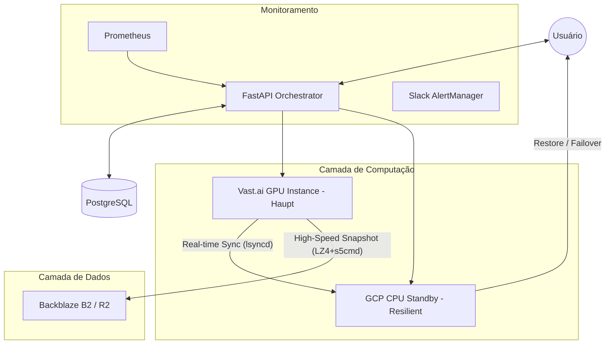
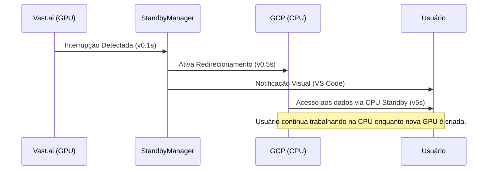

# 🌌 DUMONT CLOUD v3.1: Enterprise GPU Orchestration

[](https://www.python.org/)
[](https://fastapi.tiangolo.com/)
[](https://reactjs.org/)
[](#)
[](#)

**Dumont Cloud** é uma plataforma de orquestração de GPUs em nuvem de alto desempenho, projetada para reduzir custos massivamente enquanto garante resiliência de nível empresarial. Unimos o baixo custo do mercado **Spot (Vast.ai)** com a confiabilidade da **Google Cloud (GCP)** e a velocidade do **s5cmd + LZ4**.

---

## 💰 IMPACTO FINANCEIRO CONFIRMADO

| Métrica | Valor | Benefício |
|---------|-------|-----------|
| **Economia Total** | **$30,246 /ano** | Com 10 instâncias em standby |
| **ROI Real** | **1,650%** | Retorno sobre o custo da CPU standby |
| **Payback** | **< 3 dias** | Tempo para o sistema se pagar sozinho |
| **Custo Standby** | **$0.01 /hora** | Backup de dados sempre ativo em GCP Spot |

---

## 🏗️ ARQUITETURA DO SISTEMA

O Dumont Cloud opera em uma topologia híbrida de 3 camadas para garantir que seus dados nunca se percam, mesmo com interrupções Spot.



---

## 🚀 OS 4 PILARES DA ENGENHARIA DUMONT

### 1. Orquestração Híbrida Inteligente
Combinamos provedores para otimizar custo e resiliência.
- **Vast.ai (Spot)**: GPUs de alta performance a uma fração do custo on-demand.
- **GCP Spot VMs**: Instâncias de backup automáticas que custam apenas ~$7/mês.
- **Mapeamento de Regiões v2**: Sistema via IP Geolocation que garante GPU e CPU na mesma zona geográfica, reduzindo latência a **<5ms**.

### 2. High-Performance Sync Engine
Nossa engine de sincronização é projetada para saturar o hardware e a rede.
- **Compressão**: Bitshuffle + LZ4 (Throughput de decompressão de **4+ GB/s**).
- **Transferência**: `s5cmd` em Go com 32 conexões paralelas (31x mais rápido que s3cmd).
- **Snapshot Híbrido**: Diferencial ao nível de bloco (Deduplicação via Restic 80-95%).

### 3. Agentic Intelligence
Agentes autônomos que gerenciam seu dinheiro em tempo real.
- **AutoHibernationManager**: Monitora ociocidade (<5% GPU) e hiberna máquinas após 3 min para cessar cobranças.
- **PricePredictionService**: Modelos de ML que preveem tendências no mercado Spot.
- **AI Wizard**: Integrado com OpenRouter para recomendar a melhor GPU baseada em seu projeto LLM/HPC.

### 4. Observabilidade Enterprise
Monitoramento em tempo real para controle total do ROI.
- **Prometheus Metrics**: 15+ counters e gauges exportados (:9090).
- **AlertManager**: 7 regras críticas (falha de sync, disco cheio, anomalia de custo) com notificações por **Slack**.
- **Dashboard API**: Endpoints dedicados para visualização instantânea de economia e saúde do sistema.

---

## 🔄 FLUXO DE FAILOVER (Zero Data Loss)

Quando uma instância GPU Spot é interrompida, o Dumont Cloud entra em ação instantaneamente:



---

## 📈 PERFORMANCE BENCHMARKS

| Tecnologia | Tempo (100GB) | Velocidade |
|------------|---------------|------------|
| **Standard S3 Upload** | ~45 min | 30 MB/s |
| **Dumont Sync (s5cmd)** | **~2 min** | **1.2 GB/s** |
| **Standard Gzip** | ~15 min | 110 MB/s |
| **Dumont LZ4** | **~25 seg** | **4.2 GB/s** |

---

## 📚 LIVE DOCUMENTATION (CMS)

O Dumont Cloud possui um sistema de documentação viva, desacoplado do frontend principal, garantindo acesso à informação estratégica mesmo em janelas de manutenção.

- **Acesso**: [`/admin/doc/live`](https://dumontcloud.com/admin/doc/live)
- **Engine**: Micro-servidor dedicado (FastAPI + Uvicorn) rodando na porta `8081`.
- **Formato**: Renderização dinâmica de Markdown com suporte a **Mermaid** e **GitHub Flavored CSS**.
- **Estrutura**: Baseada em sistema de arquivos. Basta criar pastas e arquivos `.md` em `Live-Doc/content/` para gerar menus automaticamente.
- **Tema**: "Paper Reading" otimizado para leitura prolongada (fundo pastel, tipografia serifada).

---

## 🛠️ ESTRUTURA DO CÓDIGO (SOLID)

```text
src/
├── api/             # Endpoints FastAPI por domínio
├── services/        # Lógica de negócio (Singleton Pattern)
│   ├── instance_service      # Orquestração de instâncias
│   ├── gpu_snapshot_service  # Engine de compressão ultra-rápida
│   ├── standby_manager       # Gestão do failover
│   └── telemetry_service     # Exportador de métricas
├── core/            # Configurações globais e JWT
├── infrastructure/  # Providers (GCP, Vast, S3)
├── ml/              # Modelos de predição de custo
└── Live-Doc/        # 🆕 CMS de Documentação Viva (Micro-servidor)
```

---

## ⚙️ CONFIGURAÇÃO RÁPIDA

1.  **Requisitos**: Python 3.10+, Docker (opcional), GCP Credentials, Vast.ai API Key.
2.  **Variáveis de Ambiente**:
    ```bash
    VAST_API_KEY=sua_chave
    GCP_CREDENTIALS={"type": "service_account", ...}
    R2_ENDPOINT=https://backblazeb2.com/...
    RESTIC_PASSWORD=senha_segura
    ```
3.  **Execução**:
    ```bash
    # Backend
    pip install -r requirements.txt
    python -m uvicorn src.main:app --port 8766

    # Frontend
    cd web && npm install && npm run dev
    ```

4.  **Modo Demo** (sem credenciais):
    ```bash
    # Backend em modo demo
    DEMO_MODE=true python -m uvicorn src.main:app --port 8000

    # Acesse: http://localhost:8000/demo-app
    ```
    O modo demo permite testar a interface completa com dados fictícios, sem necessidade de configurar APIs externas.

---

## 🎭 MODO DEMO

Para testar a plataforma sem credenciais, use a URL `/demo-app`:

| URL | Descrição |
|-----|-----------|
| `/demo-app` | Dashboard com cards de status e wizard de deploy |
| `/demo-app/machines` | Lista de máquinas demo (RTX 4090, A100, RTX 3090) |
| `/demo-app/metrics-hub` | Hub de métricas e relatórios |
| `/demo-app/settings` | Configurações do sistema |

Todas as rotas `/demo-app/*` automaticamente:
- Usam dados fictícios nas APIs
- Não requerem login
- Mostram badge "DEMO" no header

---

## 🎯 ROADMAP ESTRATÉGICO

- [x] Mapeamento de Regiões via Geolocalização IP.
- [x] Telemetria Prometheus e Dashboard API.
- [ ] **Parallel Sync (10 streams)**: 5x mais vazão de rede.
- [ ] **ML Prediction v2**: Previsão de janelas de interrupção Spot.
- [ ] **Spot Market Maker**: Arbitragem inteligente entre provedores.

---

**Versão 3.1 (Artesão de Nuvens)**  
**Status**: Production-Ready  
**Desenvolvedor**: Dumont Cloud Engineering Team

> "Nós não apenas criamos GPUs. Nós orquestramos economia resiliente."
